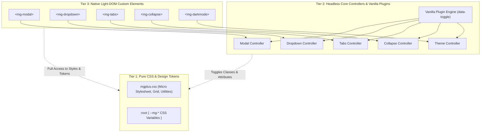

# MgPlus Architecture: Hybrid Multi-Framework Strategy (plan)

This document describes the architectural foundation for **MgPlus**, explaining how a single micro-library codebase delivers zero-runtime-dependency UI components that integrate seamlessly into modern reactive frameworks (**React, Vue, Svelte, Angular, Solid, Astro**) as well as traditional server-rendered applications (**PHP/Laravel, Rails, Django, static HTML**).

---

## 1. Executive Summary & Design Goals

Modern web development presents a common dilemma for UI libraries:
* **Framework-specific component libraries** (e.g., dedicated packages for React, Vue, and Svelte) incur huge maintenance overhead, code duplication, and diverging APIs.
* **Classic Vanilla JS plugins** (e.g. Bootstrap/Milligram data-attribute scripts) struggle in reactive Virtual DOMs because they do not automatically hook into component mount/unmount lifecycles, causing stale bindings and memory leaks.
* **Standard Shadow DOM Web Components** break CSS library styling because shadow boundaries block global stylesheet rules (`.mg-*` utility classes, typography, and flex grids).

**MgPlus solves this via a 3-Tier Hybrid Architecture powered by Native Light-DOM Web Components.**



---

## 2. The 3-Tier Layered Architecture

### Tier 1: Pure CSS Core (`mgplus.css`)
* **Philosophy**: Components are semantic HTML elements decorated with lightweight `.mg-*` classes.
* **Theming**: Completely parameterized via CSS Custom Properties (`--mg-color-primary`, `--mg-control-radius`, `--mg-base-font-size`).
* **Independence**: Fully usable without any JavaScript whatsoever for static presentation.

### Tier 2: Headless Core Controllers & Vanilla Plugins
* **Philosophy**: Core UI state machines (open/close, active tab index, theme toggling, keyboard navigation, and ARIA synchronization) are written as framework-free, headless JavaScript functions.
* **Progressive Enhancement**: The Vanilla plugin layer binds these controllers to standard HTML markups using `data-toggle="modal"` and `data-target="id"` attributes.
* **Ideal for**: Static websites, documentation portals, MPA backends (Laravel, Rails, Django, WordPress), and CDN standalone usage.

### Tier 3: Native Light-DOM Custom Elements
* **Philosophy**: Thin Custom Element wrappers (`<mg-modal>`, `<mg-dropdown>`, `<mg-tabs>`, `<mg-collapse>`) that delegate to the Tier 2 controllers.
* **Zero Dependencies**: Implemented using standard browser `HTMLElement` APIs (no Lit, Stencil, or runtime overhead).
* **Automatic Lifecycle**: `connectedCallback` and `disconnectedCallback` automatically attach and detach listeners, eliminating manual init/destroy calls in single-page apps.
* **Ideal for**: React, Vue, Svelte, Angular, Solid, and Astro applications.

---

## 3. Why Light DOM instead of Shadow DOM?

Standard Web Components encapsulate styles using `this.attachShadow({ mode: 'open' })`. While isolation is valuable for self-contained design systems, it is **counter-productive for a micro utility-first CSS library**:

```
┌────────────────────────────────────────────────────────┐
│ Shadow DOM Problem:                                    │
│ Global .mg-button, .mg-col, and typography CANNOT style│
│ elements inside the shadow tree without complex        │
│ ::part() or @adoptedStyleSheets workarounds.           │
└────────────────────────────────────────────────────────┘

┌────────────────────────────────────────────────────────┐
│ Light DOM Solution:                                    │
│ The custom element renders directly in the host DOM!   │
│ All global mgplus.css styles and CSS variables apply   │
│ immediately and natively.                              │
└────────────────────────────────────────────────────────┘
```

### Benefits of Light-DOM Custom Elements for MgPlus:
1. **100% CSS Compatibility**: Consumers can freely use `.mg-row`, `.mg-col`, `.mg-card`, `.mg-button`, and utility classes anywhere inside `<mg-modal>` or `<mg-dropdown>`.
2. **Native Framework Support**: Custom elements are recognized as valid HTML elements by every modern framework parser.
3. **Automatic Lifecycle Cleanup**: When React, Vue, or Svelte unmounts `<mg-modal>`, `disconnectedCallback()` fires automatically, unbinding global event listeners (such as `Escape` key and document click handlers) to prevent memory leaks.
4. **Zero Bundle Bloat**: No framework runtime is shipped to users; total footprint is ~2 KB gzipped.

---

## 4. Shared Core Controller Pattern

To prevent code duplication between Tier 2 (vanilla data-attributes) and Tier 3 (custom elements), both layers delegate to the same headless controller logic:

```ts
// src/core/modalController.ts (Headless Controller)
export interface ModalControllerOptions {
  onOpen?: () => void;
  onClose?: () => void;
}

export function createModalController(modal: HTMLElement, options: ModalControllerOptions = {}) {
  modal.setAttribute("role", "dialog");
  modal.setAttribute("aria-modal", "true");

  function open() {
    modal.classList.add("opened");
    modal.setAttribute("aria-hidden", "false");
    options.onOpen?.();
    modal.dispatchEvent(new CustomEvent("mg:open", { bubbles: true }));
  }

  function close() {
    modal.classList.remove("opened");
    modal.setAttribute("aria-hidden", "true");
    options.onClose?.();
    modal.dispatchEvent(new CustomEvent("mg:close", { bubbles: true }));
  }

  function handleKeydown(e: KeyboardEvent) {
    if (e.key === "Escape" && modal.classList.contains("opened")) {
      close();
    }
  }

  return { open, close, handleKeydown };
}
```

### Implementing Tier 3 with the Controller:
```ts
// src/elements/MgModal.ts
import { createModalController } from "../core/modalController";

export class MgModalElement extends HTMLElement {
  private controller?: ReturnType<typeof createModalController>;

  connectedCallback() {
    this.controller = createModalController(this);
    document.addEventListener("keydown", this.controller.handleKeydown);
  }

  disconnectedCallback() {
    if (this.controller) {
      document.removeEventListener("keydown", this.controller.handleKeydown);
    }
  }

  open() { this.controller?.open(); }
  close() { this.controller?.close(); }
}

customElements.define("mg-modal", MgModalElement);
```

---

## 5. Framework Integration Recipes

### React (18 & 19)
React 19 natively passes properties to custom elements and listens to custom events. For React 18, standard `ref` callbacks or small typed wrappers ensure seamless interoperability.

```tsx
import React, { useRef } from 'react';
import 'mgplus/css';
import 'mgplus/elements';

export function UserSettingsModal() {
  const modalRef = useRef<HTMLElement & { open: () => void; close: () => void }>(null);

  return (
    <>
      <button className="mg-button" onClick={() => modalRef.current?.open()}>
        Open Settings
      </button>

      <mg-modal ref={modalRef} class="mg-modal" id="settings-modal">
        <div className="mg-modal--dialog mg-pad-2">
          <h3>Settings</h3>
          <p>Configure preferences below.</p>
          <button className="mg-button--small" data-action="close">Close</button>
        </div>
      </mg-modal>
    </>
  );
}
```

### Vue 3
Vue natively supports custom elements without extra configuration:

```vue
<script setup lang="ts">
import { ref } from 'vue';
import 'mgplus/css';
import 'mgplus/elements';

const isDarkMode = ref(false);
</script>

<template>
  <mg-dropdown class="mg-dropdown">
    <button data-toggle="dropdown" class="mg-button--small">Actions</button>
    <div class="mg-dropdown--content">
      <ul class="mg-nav">
        <li><a href="#profile">Profile</a></li>
        <li><a href="#logout">Log Out</a></li>
      </ul>
    </div>
  </mg-dropdown>
</template>
```

### Svelte 5
Svelte compiles custom elements cleanly with full reactive binding:

```svelte
<script>
  import 'mgplus/css';
  import 'mgplus/elements';

  let modalEl;
</script>

<button class="mg-button" on:click={() => modalEl.open()}>
  Open Svelte Modal
</button>

<mg-modal bind:this={modalEl} class="mg-modal">
  <div class="mg-modal--dialog">
    <p>Rendered with Svelte</p>
    <button data-action="close">Dismiss</button>
  </div>
</mg-modal>
```

### Astro & SSR
Custom elements in Astro render directly to static HTML during build or server rendering. When client hydration occurs, the custom element class enhances the pre-rendered markup seamlessly:

```astro
---
import 'mgplus/css';
---
<script>
  import 'mgplus/elements';
</script>

<mg-tabs class="mg-tabs" data-active="0">
  <div class="mg-tabs--item" data-target="tab1">Overview</div>
  <div class="mg-tabs--item" data-target="tab2">Specs</div>
</mg-tabs>
<div id="tab1" class="mg-pad-2">Overview Content</div>
<div id="tab2" class="mg-pad-2" style="display: none;">Specs Content</div>
```

---

## 6. TypeScript JSX Intrinsic Elements

To provide first-class TypeScript autocomplete in JSX/TSX projects, MgPlus ships with intrinsic element typings:

```ts
// src/types/jsx.d.ts
declare global {
  namespace JSX {
    interface IntrinsicElements {
      'mg-modal': React.DetailedHTMLProps<React.HTMLAttributes<HTMLElement>, HTMLElement> & {
        opened?: boolean | '';
        'data-target'?: string;
      };
      'mg-dropdown': React.DetailedHTMLProps<React.HTMLAttributes<HTMLElement>, HTMLElement>;
      'mg-tabs': React.DetailedHTMLProps<React.HTMLAttributes<HTMLElement>, HTMLElement> & {
        'data-active'?: string | number;
      };
      'mg-collapse': React.DetailedHTMLProps<React.HTMLAttributes<HTMLElement>, HTMLElement> & {
        'data-target'?: string;
      };
    }
  }
}
```

---

## 7. Packaging & Subpath Exports

The library structure allows consumers to import only what they need:

```json
"exports": {
  ".": {
    "types": "./dist/types/mgplus.d.ts",
    "import": "./dist/mgplus-vanilla.js",
    "require": "./dist/mgplus-vanilla.umd.cjs"
  },
  "./elements": {
    "types": "./dist/types/elements/index.d.ts",
    "import": "./dist/mgplus-elements.js"
  },
  "./css": "./dist/mgplus.css",
  "./package.json": "./package.json"
}
```

| Import Statement | What it Loads | Best For |
| :--- | :--- | :--- |
| `import 'mgplus/css'` | Compiled CSS bundle (69 KB) | Pure CSS projects, Tailwind/Bootstrap replacements |
| `import 'mgplus'` | Full bundle: CSS + Vanilla JS data-attribute plugins | Static sites, MPAs, quick prototyping |
| `import 'mgplus/elements'` | Zero-dep Light-DOM Web Components (< 3 KB) | React, Vue, Svelte, Angular, Solid, Astro |
